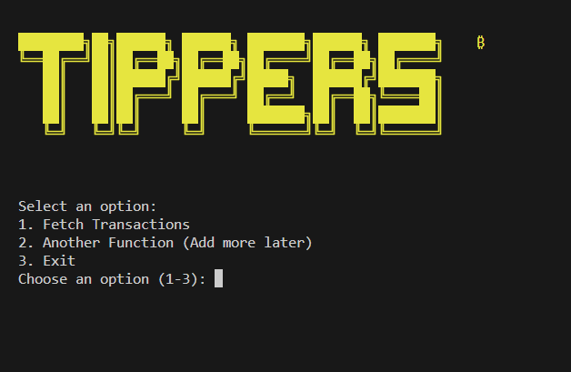

# TIPPERS API

```
████████╗██╗██████╗ ██████╗ ███████╗██████╗ ███████╗     █████╗ ██████╗ ██╗
╚══██╔══╝██║██╔══██╗██╔══██╗██╔════╝██╔══██╗██╔════╝    ██╔══██╗██╔══██╗██║
   ██║   ██║██████╔╝██████╔╝█████╗  ██████╔╝███████╗    ███████║██████╔╝██║
   ██║   ██║██╔═══╝ ██╔═══╝ ██╔══╝  ██╔══██╗╚════██║    ██╔══██║██╔═══╝ ██║
   ██║   ██║██║     ██║     ███████╗██║  ██║███████║    ██║  ██║██║     ██║
   ╚═╝   ╚═╝╚═╝     ╚═╝     ╚══════╝╚═╝  ╚═╝╚══════╝    ╚═╝  ╚═╝╚═╝     ╚═╝
```

## Overview

TIPPERS API is a RESTful service for managing transaction data. Built with Fastify for high performance and low overhead.

<p align="center">
  
</p>

# TIPPERS API

## Prerequisites

This app requires an Etherscan API key. You'll need to:

1. Sign up at Etherscan.io
2. Generate an API key in your account dashboard
3. Add the API key to your .env file

## Installation

```bash
# Clone repository
git clone https://github.com/yourusername/tippers-api.git

# Navigate to project directory
cd tippers-api

# Install dependencies
npm install i

# Set up environment variables
cp .env.sample .env

# Update the .env file with your Etherscan API key
```

## Configuration

Edit the `.env` file to add your Etherscan API key and configure other settings:

```
PORT=3000
MONGODB_URI=mongodb://localhost:27017/tippers
ETHERSCAN_API_KEY=YOUR_API_KEY_HERE
```

## Usage

```bash
# Start the API server
node app.js

# In a new terminal, run the data fetcher
node fetcher.js

# Follow the interactive prompts:
# 1. Select option 1
# 2. Enter "Ethereum Mainnet" when prompted for token
```

## API Endpoints

### Transactions

- `GET /api/transactions` - Get all transactions
- `GET /api/transactions/:id` - Get transaction by ID
- `POST /api/transactions` - Create a new transaction
- `PUT /api/transactions/:id` - Update a transaction
- `DELETE /api/transactions/:id` - Delete a transaction

## Features

- Transaction management
- Fast and efficient data processing
- Blockchain integration via Etherscan API
- Secure authentication
- Interactive CLI interface

## License

MIT
